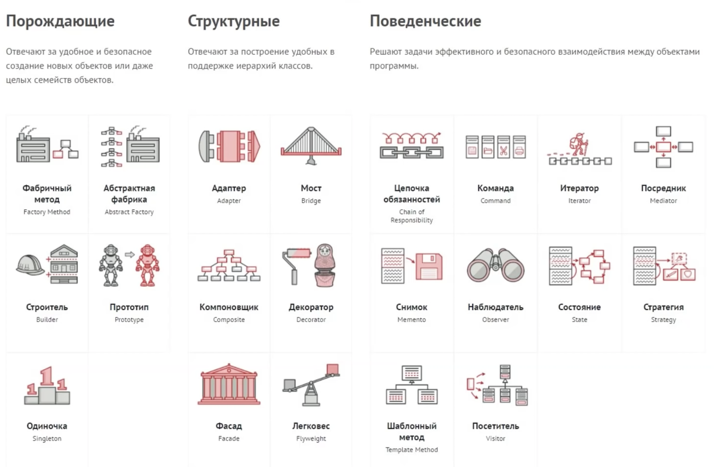

# js-design-patterns
JavaScript Design Patterns

### --- Creational ---
|          Description          |       Implementations      |
| ----------------------------- | -------------------------- |
|                               | [Module][module]           |
|                               | [Constructor][constructor] |
|                               | [Singleton][singleton]     |
|                               | [Prototype][prototype]     |
|                               | [Facade][facade]           |
|                               | [Factory][factory]         |
|                               | [Mixin][mixin]             |

### --- Structural ---
|          Description          |       Implementations      |
| ----------------------------- | -------------------------- |
|                               | [Mediator][mediator]       |
|                               | [Facade][facade]           |
|                               | [Mixin][mixin]             |
|                               | [Proxy][proxy]             |
|                               | [Decorator][decorator]     |
|                               | [Flyweight][flyweight]     |
### --- Behaviour ---
|          Description          |       Implementations      |
| ----------------------------- | -------------------------- |
|                               | [Observer][observer]       |
|                               | [Mediator][mediator]       |
|                               | [Command][command]         |
|                               | [Mixin][mixin]             |
|                               | [Proxy][proxy]             |
|                               | [State][state]             |

[module]:      patterns/module.js
[constructor]: patterns/constructor.js
[singleton]:   patterns/singleton.js
[observer]:    patterns/observer.js
[mediator]:    patterns/mediator.js
[prototype]:   patterns/prototype.js
[command]:     patterns/command.js
[facade]:      patterns/facade.js
[factory]:     patterns/factory.js
[mixin]:       patterns/mixin.js
[proxy]:       patterns/proxy.js
[state]:       patterns/state.js
[decorator]:   patterns/decorator.js
[flyweight]:   patterns/flyweight.js

https://www.dofactory.com/javascript/design-patterns/abstract-factory